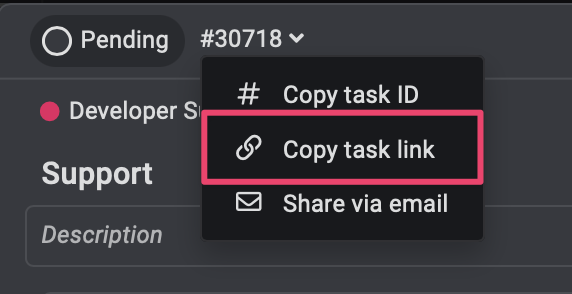

# ProofHub GitHub Integration

Auto-update ProofHub tasks when you merge PRs. Includes parent-subtask logic that ProofHub doesn't have by default.

---

## Why I Made This

Our team kept forgetting to update ProofHub tasks after merging PRs. With hundreds of tasks, it became a mess to track what's actually done.

The bigger problem? **ProofHub doesn't handle parent-subtask relationships well.**

If you've used Jira, you know how parent-child tasks work - when subtasks move, the parent updates automatically. ProofHub doesn't do this. Each task is independent, so:

- Parent task sits in "To Do" while all subtasks are done
- No way to see overall progress when multiple devs work on different subtasks
- You have to manually track and update parent tasks
- Zero visibility on the top-level status of a feature

This was painful as the team grew. So I built this integration to handle it automatically.

---

## What It Does

### Automatic Task Updates
When you merge a PR, tasks mentioned in the PR description automatically move to the correct stage based on the target branch.

- Merge to `development` → tasks move to "In Progress"
- Merge to `main` → tasks move to "Completed"
- No more manual updates

### Parent-Subtask Logic (The Important Part)
You can set up custom rules for how parent tasks should behave:

**Example:**
- If **some** subtasks reach "Development Completed" → move parent to "In Progress"
- If **all** subtasks reach "Development Completed" → move parent to "Development Completed"

It only moves tasks forward (no going backward), so you don't accidentally mess up your workflow.

---

## Setup

### 1. Install

Create `.github/workflows/proofhub-automation.yml`:

```yaml
name: ProofHub Task Automation

on:
  pull_request:
    types: [closed]
    branches:
      - main
      - development
      - staging

jobs:
  update-tasks:
    if: github.event.pull_request.merged == true
    runs-on: ubuntu-latest

    steps:
      - name: Checkout code
        uses: actions/checkout@v3

      - name: Setup Node.js
        uses: actions/setup-node@v3
        with:
          node-version: '18'

      - name: Install dependencies
        run: npm install

      - name: Update ProofHub Tasks
        env:
          PROOFHUB_API_KEY: ${{ secrets.PROOFHUB_API_KEY }}
          TARGET_BRANCH: ${{ github.event.pull_request.base.ref }}
          PR_BODY: ${{ github.event.pull_request.body }}
          PR_NUMBER: ${{ github.event.pull_request.number }}
        run: node proofhub-automation.js
```

### 2. Configure

Create `config.json`:

```json
{
  "proofhub": {
    "apiUrl": "https://api.proofhub.com",
    "projectId": "your-project-id",
    "todoListId": "your-todolist-id"
  },
  "stages": {
    "development": {
      "targetStage": "In Progress",
      "targetStageId": "12345"
    },
    "main": {
      "targetStage": "Completed",
      "targetStageId": "67890"
    }
  },
  "stageHierarchy": {
    "To Do": 1,
    "In Progress": 2,
    "Development Completed": 3,
    "QA Testing": 4,
    "Completed": 5
  },
  "parentRules": [
    {
      "parentStage": "To Do",
      "actions": [
        {
          "condition": "some",
          "subtaskStage": "In Progress",
          "moveParentTo": "In Progress"
        },
        {
          "condition": "all",
          "subtaskStage": "Development Completed",
          "moveParentTo": "Development Completed"
        }
      ]
    }
  ],
  "features": {
    "parentRulesEnabled": true
  }
}
```

### 3. Add GitHub Secret

Go to your repo settings → Secrets → Add `PROOFHUB_API_KEY`

### 4. Format Your PRs

In your PR description, list tasks like this:

```markdown
### 📋 ProofHub Tasks

- link of the task
```

That's it.

---

## How to Get ProofHub Task Links

**API Key:**
ProofHub → Settings → API → Generate key

**Project ID:**
Open your project, check URL: `proofhub.com/projects/1234567890`

**Todo List ID:**
Open task list, check URL: `proofhub.com/projects/xxx/todolists/9876543210`

**Copy Task Link:**


**Stage IDs:**
```bash
curl -H "X-API-Key: YOUR_KEY" https://api.proofhub.com/api/v3/workflows
```

Look for your workflow stages and grab the IDs.

---

## What You'll See

When a PR merges, you'll get output like:

```
🚀 ProofHub Task Automation

Target Branch: development
Target Stage: In Progress

Found 2 tasks: 1234567890, 9876543210

✅ Task #1234567890 → "In Progress"
✅ Task #9876543210 → "In Progress"

Processing 1 parent task...

✅ Task #1111111111 → "In Progress" (Some subtasks moved)

Summary: 2 tasks updated, 1 parent updated
```

---

## Troubleshooting

**Tasks not updating?**
- Check task IDs are correct (9+ digits)
- Make sure you have the `### 📋 ProofHub Tasks` header
- Verify stage IDs in config match your ProofHub workflow

**Parent not updating?**
- Set `parentRulesEnabled: true` in config
- Check subtasks have the correct parent_id in ProofHub
- Make sure stage hierarchy is set correctly

---

## Files

```
.github/
  └── workflows/
      └── proofhub-automation.yml
  └── scripts/
      └── proofhub-automation.js
      └── config.json
```

---

If this helps you, give it a star ⭐